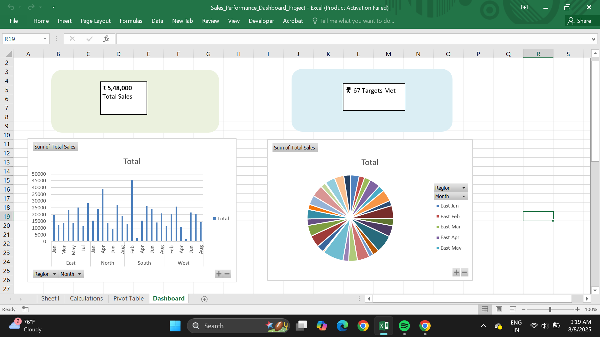
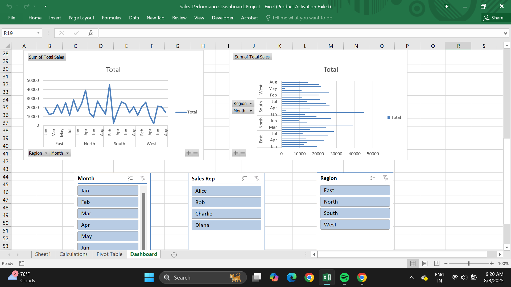

# 📊 Sales Performance Dashboard (Excel)

This project showcases a **Sales Performance Dashboard** created using **Microsoft Excel** to analyze and visualize key sales metrics.  
The dashboard is designed to help monitor performance, track progress toward sales targets, and make data-driven decisions with ease.

---

## 🔍 Project Overview

The dashboard is built using a sample dataset containing **100+ rows** of sales data.  
It includes details such as:

- **Order Date**
- **Product Name**
- **Category**
- **Region**
- **Sales Amount**
- **Quantity Sold**
- **Sales Target**

The main purpose is to provide an **interactive view** of business performance across regions and categories while comparing actual sales with targets.

---

## 📌 Key Features

- **Interactive Slicers** to filter by Region, Product, or Category  
- **KPI Cards** displaying:
  - Total Sales
  - Total Quantity Sold
  - Average Sales per Order
  - % Target Achieved
- **Pivot Tables & Charts** summarizing:
  - Sales by Region
  - Sales by Product
  - Monthly Performance Trends
- **Visual Elements** including bar charts, line graphs, and pie charts
- **Conditional Formatting** to highlight performance gaps or achievements
- Clean, user-friendly design for better readability

---

## 🎯 Purpose

The goal of this project is to demonstrate **Excel-based data analytics and dashboard building skills**, which are valuable for beginner and intermediate data analysts.  
It also serves as a portfolio project for showcasing:

- Data cleaning and preparation  
- Using formulas for calculations  
- Building visualizations  
- Creating interactive dashboards without coding  

---

## 🛠 Tools & Techniques Used

- **Microsoft Excel**
- **Pivot Tables & Pivot Charts**
- **Formulas**: `SUM`, `COUNT`, `AVERAGE`, `IF`, `SUMIF`, `COUNTIF`, etc.
- **Slicers** for dynamic filtering
- **Conditional Formatting** for visual emphasis

---

## 💼 Use Case

This dashboard can be adapted for:

- Small business sales tracking  
- Student projects  
- Demonstrations of Excel reporting skills  
- Quick performance monitoring without using BI tools  

---

## 📷 Screenshot

---

## 📂 Project Files

- `Sales_Performance_Dashboard.xlsx` – Main Excel file with dashboard and dataset  
- `README.md` – Project documentation  

---

